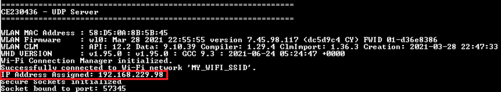

# AnyCloud: UDP Server

This code example demonstrates the implementation of a UDP server with PSoC&trade; 6 MCU and AIROC™ CYW43xxx Wi-Fi & Bluetooth® combo chips.

In this example, the UDP server waits for the UDP client to establish connection. Once the connection is established, the server allows the user to send the LED ON/OFF command to the UDP client through a button press; the client responds by sending an acknowledgement message to the server.

This example uses the [Wi-Fi Middleware Core](https://github.com/cypresssemiconductorco/wifi-mw-core) library of the AnyCloud SDK. This library enables Wi-Fi-based application development by bundling together various other libraries - FreeRTOS, Wi-Fi Host Driver (WHD), lwIP, and Cypress Secure Sockets. The Cypress Secure Sockets library provides an easy-to-use API by abstracting the network stack (lwIP).

[Provide feedback on this code example.](https://cypress.co1.qualtrics.com/jfe/form/SV_1NTns53sK2yiljn?Q_EED=eyJVbmlxdWUgRG9jIElkIjoiQ0UyMzA0MzYiLCJTcGVjIE51bWJlciI6IjAwMi0zMDQzNiIsIkRvYyBUaXRsZSI6IkFueUNsb3VkOiBVRFAgU2VydmVyIiwicmlkIjoibXVhYSIsIkRvYyB2ZXJzaW9uIjoiMi4yLjAiLCJEb2MgTGFuZ3VhZ2UiOiJFbmdsaXNoIiwiRG9jIERpdmlzaW9uIjoiTUNEIiwiRG9jIEJVIjoiSUNXIiwiRG9jIEZhbWlseSI6IlBTT0MifQ==)

## Requirements

- [ModusToolbox&trade; software](https://www.cypress.com/products/modustoolbox-software-environment) v2.2 or later.

  **Note:** This code example version requires ModusToolbox software version 2.2 or later and is not backward compatible with v2.1 or older versions. If you cannot move to ModusToolbox v2.2 or later, use the latest compatible version of this example: [latest-v1.X](https://github.com/cypresssemiconductorco/mtb-example-anycloud-udp-server/tree/latest-v1.X).

- Board Support Package (BSP) minimum required version: 2.0.0
- Programming Language: C
- Associated Parts:
  - All [PSoC&trade; 6 MCU](http://www.cypress.com/PSoC6) parts with SDIO

  - [AIROC™ CYW43012 Wi-Fi & Bluetooth combo chip](https://www.cypress.com/documentation/product-overviews/cypress-cyw43012)
  - [AIROC™ CYW4343W Wi-Fi & Bluetooth combo chip](https://www.cypress.com/documentation/datasheets/cyw4343w-single-chip-80211-bgn-macbasebandradio-bluetooth-41)

## Supported toolchains (make variable 'TOOLCHAIN')

- GNU Arm® Embedded Compiler v9.3.1 (`GCC_ARM`) - Default value of `TOOLCHAIN`
- IAR C/C++ compiler v8.42.2 (`IAR`)
- Arm compiler v6.13 (`ARM`)

## Supported kits (make variable 'TARGET')

- [PSoC 6 Wi-Fi Bluetooth prototyping kit](https://www.cypress.com/CY8CPROTO-062-4343W) (`CY8CPROTO-062-4343W`) - Default value of `TARGET`
- [PSoC 6 WiFi Bluetooth pioneer kit](https://www.cypress.com/CY8CKIT-062-WiFi-BT) (`CY8CKIT-062-WIFI-BT`)
- [PSoC 62S2 Wi-Fi Bluetooth pioneer kit](https://www.cypress.com/CY8CKIT-062S2-43012) (`CY8CKIT-062S2-43012`)
- [PSoC 62S1 Wi-Fi Bluetooth pioneer kit](https://www.cypress.com/CYW9P62S1-43438EVB-01) (`CYW9P62S1-43438EVB-01`)
- [PSoC 62S1 Wi-Fi Bluetooth pioneer kit](https://www.cypress.com/CYW9P62S1-43012EVB-01) (`CYW9P62S1-43012EVB-01`)
- CYSBSYSKIT-01 Rapid IoT Connect Platform RP01 Feather Kit (`CYSBSYSKIT-01`)
- Rapid IoT Connect Developer Kit (`CYSBSYSKIT-DEV-01`)

## Hardware setup

This example uses the board's default configuration. See the kit user guide to ensure that the board is configured correctly.

**Note:** The PSoC 6 Wi-Fi Bluetooth pioneer kit (CY8CKIT-062-WIFI-BT) ships with KitProg2 installed. The ModusToolbox software requires KitProg3. Before using this code example, make sure that the board is upgraded to KitProg3. The tool and instructions are available in the [Firmware Loader](https://github.com/cypresssemiconductorco/Firmware-loader) GitHub repository. If you do not upgrade, you will see an error like "unable to find CMSIS-DAP device" or "KitProg firmware is out of date".

## Software setup

- Install a terminal emulator if you don't have one. Instructions in this document use [Tera Term](https://ttssh2.osdn.jp/index.html.en).

- Install a Python Interpreter if you don't have one. This code example is tested with [Python 3.7.7](https://www.python.org/downloads/release/python-377/).

## Using the code example

Create the project and open it using one of the following:

<details><summary><b>In Eclipse IDE for ModusToolbox</b></summary>

1. Click the **New Application** link in the **Quick Panel** (or, use **File** > **New** > **ModusToolbox Application**). This launches the [Project Creator](http://www.cypress.com/ModusToolboxProjectCreator) tool.

2. Pick a kit supported by the code example from the list shown in the **Project Creator - Choose Board Support Package (BSP)** dialog.

   When you select a supported kit, the example is reconfigured automatically to work with the kit. To work with a different supported kit later, use the [Library Manager](https://www.cypress.com/ModusToolboxLibraryManager) to choose the BSP for the supported kit. You can use the Library Manager to select or update the BSP and firmware libraries used in this application. To access the Library Manager, click the link from the **Quick Panel**.

   You can also just start the application creation process again and select a different kit.

   If you want to use the application for a kit not listed here, you may need to update the source files. If the kit does not have the required resources, the application may not work.

3. In the **Project Creator - Select Application** dialog, choose the example by enabling the checkbox.

4. Optionally, change the suggested **New Application Name**.

5. Enter the local path in the **Application(s) Root Path** field to indicate where the application needs to be created.

   Applications that can share libraries can be placed in the same root path.

6. Click **Create** to complete the application creation process.

For more details, see the [Eclipse IDE for ModusToolbox User Guide](https://www.cypress.com/MTBEclipseIDEUserGuide) (locally available at *{ModusToolbox install directory}/ide_{version}/docs/mt_ide_user_guide.pdf*).

</details>

<details><summary><b>In command-line interface (CLI)</b></summary>

ModusToolbox provides the Project Creator as both a GUI tool and a command line tool to easily create one or more ModusToolbox applications. See the "Project Creator Tools" section of the [ModusToolbox User Guide](https://www.cypress.com/ModusToolboxUserGuide) for more details.

Alternatively, you can manually create the application using the following steps:

1. Download and unzip this repository onto your local machine, or clone the repository.

2. Open a CLI terminal and navigate to the application folder.

   On Windows, use the command line **modus-shell** program provided in the ModusToolbox installation instead of a standard Windows command line application. This shell provides access to all ModusToolbox tools. You can access it by typing `modus-shell` in the search box in the Windows menu.

   In Linux and macOS, you can use any terminal application.

   **Note:** The cloned application contains a default BSP file (*TARGET_xxx.mtb*) in the *deps* folder. Use the [Library Manager](https://www.cypress.com/ModusToolboxLibraryManager) (`make modlibs` command) to select and download a different BSP file, if required. If the selected kit does not have the required resources or is not [supported](#supported-kits-make-variable-target), the application may not work.

3. Import the required libraries by executing the `make getlibs` command.

Various CLI tools include a `-h` option that prints help information to the terminal screen about that tool. For more details, see the [ModusToolbox User Guide](https://www.cypress.com/ModusToolboxUserGuide) (locally available at *{ModusToolbox install directory}/docs_{version}/mtb_user_guide.pdf*).

</details>

<details><summary><b>In third-party IDEs</b></summary>

1. Follow the instructions from the **In command-line interface (CLI)** section to create the application, and import the libraries using the `make getlibs` command.

2. Export the application to a supported IDE using the `make <ide>` command.

   For a list of supported IDEs and more details, see the "Exporting to IDEs" section of the [ModusToolbox User Guide](https://www.cypress.com/ModusToolboxUserGuide) (locally available at *{ModusToolbox install directory}/docs_{version}/mtb_user_guide.pdf*.

3. Follow the instructions displayed in the terminal to create or import the application as an IDE project.

</details>

## Operation

1. Connect the board to your PC using the provided USB cable through the KitProg3 USB connector.

2. Modify the `WIFI_SSID`, `WIFI_PASSWORD`, and `WIFI_SECURITY_TYPE` macros to match the credentials of the Wi-Fi network that you want to connect. These macros are defined in the *udp_server.h* file. Ensure that the Wi-Fi network that you are connecting to is configured as a private network for the proper functioning of this example.

   **Note:** CYSBSYSKIT-01 reserves UDP and TCP port numbers from `49152` to `57343`.

3. Open a terminal program and select the KitProg3 COM port. Set the serial port parameters to 8N1 and 115200 baud.

3. Program the board using one of the following:

   <details><summary><b>Using Eclipse IDE for ModusToolbox</b></summary>

      1. Select the application project in the Project Explorer.

      2. In the **Quick Panel**, scroll down, and click **\<Application Name> Program (KitProg3_MiniProg4)**.
      </details>

   <details><summary><b>Using CLI</b></summary>

     From the terminal, execute the `make program` command to build and program the application using the default toolchain to the default target. You can specify a target and toolchain manually:
      ```
      make program TARGET=<BSP> TOOLCHAIN=<toolchain>
      ```

      Example:
      ```
      make program TARGET=CY8CPROTO-062-4343W TOOLCHAIN=GCC_ARM
      ```
   </details>

     After programming, the application starts automatically. Confirm that the following text as shown in Figure 1 is displayed on the UART terminal. Note that Wi-Fi SSID and the IP address assigned will be different based on the network that you have connected to.

     **Figure 1. UART terminal showing the Wi-Fi connectivity status**

     


5. Ensure that your computer is connected to the same Wi-Fi access point that you have configured in Step 2. Make a note of the IP address assigned to the kit as shown in Figure 1.

6. Open a command shell form the project directory and run the Python UDP client (*udp_client.py*) with the IP address from Figure 1 as argument through the option `--hostname`.

   For example, if the IP address assigned to your kit is `192.168.43.231`, enter the command as follows:

   ```
   python udp_client.py --hostname 192.168.43.231
   ```

   **Note:** Ensure that the firewall settings of your computer allow access to the Python software so that it can communicate with the UDP server. For more details on enabling Python access, see this [community thread](https://community.cypress.com/thread/53662).

7. Press the user button (CYBSP_USER_BTN) to send the LED ON/OFF command to the Python UDP client. Each user button press will issue the LED ON or LED OFF commands alternately. The client in turn sends an acknowledgement message back to the server. Figure 2 and Figure 3 show the UDP server and UDP client outputs respectively:

   **Figure 2. UDP server output**

   

   <br>

   **Figure 3. UDP client output**

   

   **Note:** Instead of using the Python UDP client (*udp_client.py*), you can use the [mtb-example-anycloud-udp-client](https://github.com/cypresssemiconductorco/mtb-example-anycloud-udp-client) example to run as UDP client on a second kit. See the code example documentation to learn how to use the example.

## Debugging

You can debug the example to step through the code. In the IDE, use the **\<Application Name> Debug (KitProg3_MiniProg4)** configuration in the **Quick Panel**. For more details, see the "Program and debug" section in the [Eclipse IDE for ModusToolbox User Guide](https://www.cypress.com/MTBEclipseIDEUserGuide).

**Note:** **(Only while debugging)** On the CM4 CPU, some code in `main()` may execute before the debugger halts at the beginning of `main()`. This means that some code executes twice - once before the debugger stops execution, and again after the debugger resets the program counter to the beginning of `main()`. See [KBA231071](https://community.cypress.com/docs/DOC-21143) to learn about this and for the workaround.

## Design and implementation

### Resources and settings

**Table 1. Application resources**

| Resource  |  Alias/object     |    Purpose     |
| :------- | :------------    | :------------ |
| SDIO (HAL) | sdio_obj | SDIO interface for Wi-Fi connectivity |
| UART (HAL) |cy_retarget_io_uart_obj| UART HAL object used by Retarget-IO for Debug UART port |
| BUTTON (BSP) | CYBSP_USER_BTN | User button used to send LED ON/OFF commands to UDP client |

<br>

This example uses the Arm® Cortex®-M4 (CM4) CPU of PSoC 6 MCU to execute an RTOS task: UDP Server task. At device reset, the default Cortex-M0+ (CM0+) application enables the CM4 CPU and configures the CM0+ CPU to go to sleep.

In this example, the UDP server waits for the UDP client to establish the connection. Once the connection completes, the server allows you to send the LED ON/OFF command to the UDP client; the client responds by sending an acknowledgement message to the server.

**Note:** The CY8CPROTO-062-4343W board shares the same GPIO for the user button (CYBSP_USER_BTN) and the AIROC™ CYW4343W Wi-Fi Bluetooth® combo chip host wakeup pin. Because this example uses the GPIO for interfacing with the user button, the SDIO interrupt to wake up the host is disabled by setting `CY_WIFI_HOST_WAKE_SW_FORCE` to '0' in the Makefile through the `DEFINES` variable.

## Related resources

| Application notes                                            |                                                              |
| :----------------------------------------------------------- | :----------------------------------------------------------- |
| [AN228571](https://www.cypress.com/AN228571) – Getting started with PSoC 6 MCU on ModusToolbox | Describes PSoC 6 MCU devices and how to build your first application with ModusToolbox |
| [AN221774](https://www.cypress.com/AN221774) – Getting started with PSoC 6 MCU on PSoC Creator | Describes PSoC 6 MCU devices and how to build your first application with PSoC Creator |
| [AN210781](https://www.cypress.com/AN210781) – Getting started with PSoC 6 MCU with Bluetooth Low Energy connectivity on PSoC Creator | Describes PSoC 6 MCU with Bluetooth LE connectivity devices and how to build your first application with PSoC Creator |
| [AN215656](https://www.cypress.com/AN215656) – PSoC 6 MCU: dual-CPU system design | Describes the dual-CPU architecture in PSoC 6 MCU, and shows how to build a simple dual-CPU design |
| **Code examples**                                            |                                                              |
| [Using ModusToolbox](https://github.com/cypresssemiconductorco/Code-Examples-for-ModusToolbox-Software) | [Using PSoC Creator](https://www.cypress.com/documentation/code-examples/psoc-6-mcu-code-examples) |
| **Device documentation**                                     |                                                              |
| [PSoC 6 MCU datasheets](https://www.cypress.com/search/all?f[0]=meta_type%3Atechnical_documents&f[1]=resource_meta_type%3A575&f[2]=field_related_products%3A114026) | [PSoC 6 technical reference manuals](https://www.cypress.com/search/all/PSoC%206%20Technical%20Reference%20Manual?f[0]=meta_type%3Atechnical_documents&f[1]=resource_meta_type%3A583) |
| **Development kits**                                         | Buy at www.cypress.com                                       |
| [CY8CKIT-062-WiFi-BT](https://www.cypress.com/CY8CKIT-062-WiFi-BT) PSoC 6 Wi-Fi Bluetooth pioneer kit | [CY8CPROTO-062-4343W](https://www.cypress.com/CY8CPROTO-062-4343W) PSoC 6 Wi-Fi Bluetooth prototyping kit |
| [CY8CKIT-062S2-43012](https://www.cypress.com/CY8CKIT-062S2-43012) PSoC 62S2 Wi-Fi Bluetooth pioneer kit | [CYW9P62S1-43438EVB-01](https://www.cypress.com/CYW9P62S1-43438EVB-01) PSoC 62S1 Wi-Fi Bluetooth pioneer kit |
| [CYW9P62S1-43012EVB-01](https://www.cypress.com/CYW9P62S1-43012EVB-01) PSoC 62S1 Wi-Fi Bluetooth pioneer kit | CYSBSYSKIT-01 Rapid IoT connect platform RP01 feather kit |
| CYSBSYSKIT-DEV-01 Rapid IoT connect developer kit |                                                |
| **Libraries**                                                 |                                                              |
| PSoC 6 peripheral driver library (PDL) and docs  | [mtb-pdl-cat1](https://github.com/cypresssemiconductorco/mtb-pdl-cat1) on GitHub |
| Hardware abstraction layer (HAL) Library and docs    | [mtb-hal-cat1](https://github.com/cypresssemiconductorco/mtb-hal-cat1) on GitHub |
| Retarget IO - A utility library to retarget the standard input/output (STDIO) messages to a UART port | [retarget-io](https://github.com/cypresssemiconductorco/retarget-io) on GitHub |
| **Middleware**                                               |                                                              |
| Wi-Fi Middleware core library                                    | [wifi-mw-core](https://github.com/cypresssemiconductorco/wifi-mw-core) on GitHub |
| Secure Sockets library                                       |[secure-sockets](https://github.com/cypresssemiconductorco/secure-sockets) on GitHub |
| CapSense&trade; library and documents                                   | [capsense](https://github.com/cypresssemiconductorco/capsense) on GitHub |
| Links to all PSoC 6 MCU middleware                           | [psoc6-middleware](https://github.com/cypresssemiconductorco/psoc6-middleware) on GitHub |
| **Tools**                                                    |                                                              |
| [Eclipse IDE for ModusToolbox](https://www.cypress.com/modustoolbox) | The cross-platform, Eclipse-based IDE for IoT designers that supports application configuration and development targeting converged MCU and wireless systems. |
| [PSoC Creator™](https://www.cypress.com/products/psoc-creator-integrated-design-environment-ide) | The legacy Cypress IDE for PSoC and FM0+ MCU development. |

## Other resources

Cypress provides a wealth of data at www.cypress.com to help you select the right device, and quickly and effectively integrate it into your design.

For PSoC 6 MCU devices, see [How to design with PSoC 6 MCU - KBA223067](https://community.cypress.com/docs/DOC-14644) in the Cypress community.

## Document history

Document Title: *CE230436* - *AnyCloud: UDP Server*

| Version | Description of Change |
| ------- | --------------------- |
| 1.0.0   | New code example      |
| 2.0.0   | Major update to support ModusToolbox software v2.2, added support for new kits.<br /> This version is not backward compatible with ModusToolbox software v2.1.  |
| 2.1.0   | Added support for CYSBSYSKIT-01 and CYSBSYSKIT-DEV-01 |
| 2.2.0   | Updated to FreeRTOS v10.3.1                           |
------

All other trademarks or registered trademarks referenced herein are the property of their respective owners.


-------------------------------------------------------------------------------

© Cypress Semiconductor Corporation, 2020-2021. This document is the property of Cypress Semiconductor Corporation, an Infineon Technologies company, and its affiliates ("Cypress").  This document, including any software or firmware included or referenced in this document ("Software"), is owned by Cypress under the intellectual property laws and treaties of the United States and other countries worldwide.  Cypress reserves all rights under such laws and treaties and does not, except as specifically stated in this paragraph, grant any license under its patents, copyrights, trademarks, or other intellectual property rights.  If the Software is not accompanied by a license agreement and you do not otherwise have a written agreement with Cypress governing the use of the Software, then Cypress hereby grants you a personal, non-exclusive, nontransferable license (without the right to sublicense) (1) under its copyright rights in the Software (a) for Software provided in source code form, to modify and reproduce the Software solely for use with Cypress hardware products, only internally within your organization, and (b) to distribute the Software in binary code form externally to end users (either directly or indirectly through resellers and distributors), solely for use on Cypress hardware product units, and (2) under those claims of Cypress’s patents that are infringed by the Software (as provided by Cypress, unmodified) to make, use, distribute, and import the Software solely for use with Cypress hardware products.  Any other use, reproduction, modification, translation, or compilation of the Software is prohibited.
<br>
TO THE EXTENT PERMITTED BY APPLICABLE LAW, CYPRESS MAKES NO WARRANTY OF ANY KIND, EXPRESS OR IMPLIED, WITH REGARD TO THIS DOCUMENT OR ANY SOFTWARE OR ACCOMPANYING HARDWARE, INCLUDING, BUT NOT LIMITED TO, THE IMPLIED WARRANTIES OF MERCHANTABILITY AND FITNESS FOR A PARTICULAR PURPOSE.  No computing device can be absolutely secure.  Therefore, despite security measures implemented in Cypress hardware or software products, Cypress shall have no liability arising out of any security breach, such as unauthorized access to or use of a Cypress product.  CYPRESS DOES NOT REPRESENT, WARRANT, OR GUARANTEE THAT CYPRESS PRODUCTS, OR SYSTEMS CREATED USING CYPRESS PRODUCTS, WILL BE FREE FROM CORRUPTION, ATTACK, VIRUSES, INTERFERENCE, HACKING, DATA LOSS OR THEFT, OR OTHER SECURITY INTRUSION (collectively, "Security Breach").  Cypress disclaims any liability relating to any Security Breach, and you shall and hereby do release Cypress from any claim, damage, or other liability arising from any Security Breach.  In addition, the products described in these materials may contain design defects or errors known as errata which may cause the product to deviate from published specifications.  To the extent permitted by applicable law, Cypress reserves the right to make changes to this document without further notice. Cypress does not assume any liability arising out of the application or use of any product or circuit described in this document.  Any information provided in this document, including any sample design information or programming code, is provided only for reference purposes.  It is the responsibility of the user of this document to properly design, program, and test the functionality and safety of any application made of this information and any resulting product.  "High-Risk Device" means any device or system whose failure could cause personal injury, death, or property damage.  Examples of High-Risk Devices are weapons, nuclear installations, surgical implants, and other medical devices.  "Critical Component" means any component of a High-Risk Device whose failure to perform can be reasonably expected to cause, directly or indirectly, the failure of the High-Risk Device, or to affect its safety or effectiveness.  Cypress is not liable, in whole or in part, and you shall and hereby do release Cypress from any claim, damage, or other liability arising from any use of a Cypress product as a Critical Component in a High-Risk Device.  You shall indemnify and hold Cypress, including its affiliates, and its directors, officers, employees, agents, distributors, and assigns harmless from and against all claims, costs, damages, and expenses, arising out of any claim, including claims for product liability, personal injury or death, or property damage arising from any use of a Cypress product as a Critical Component in a High-Risk Device.  Cypress products are not intended or authorized for use as a Critical Component in any High-Risk Device except to the limited extent that (i) Cypress’s published data sheet for the product explicitly states Cypress has qualified the product for use in a specific High-Risk Device, or (ii) Cypress has given you advance written authorization to use the product as a Critical Component in the specific High-Risk Device and you have signed a separate indemnification agreement.
<br>
Cypress, the Cypress logo, and combinations thereof, WICED, ModusToolBox, PSoC, CapSense, EZ-USB, F-RAM, and Traveo are trademarks or registered trademarks of Cypress or a subsidiary of Cypress in the United States or in other countries.  For a more complete list of Cypress trademarks, visit cypress.com.  Other names and brands may be claimed as property of their respective owners.
